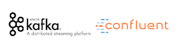

 

#Confluent Kafka AsyncAPI template

<!-- toc -->

- [Minimum for your template](#minimum-for-your-template)
- [Technical Requirements](#technical-requirements)
  * [Prerequisites](#prerequisites)
  * [To run this template](#to-run-this-template)
- [Contributors](#contributors)

<!-- tocstop -->

## Summary

TODO 


## Technical Requirements

### Prerequisites

TODO npm & python

### To run this template

Install asyncapi generator
`npm install -g @asyncapi/generator`

Call generator to execute this template on your AsyncAPI file
```
ag path_to_asyncapi.yaml @ekozynin/asyncapi-kafka-template \
    --output output/scripts --force-write 
```

Run generated python scripts to deploy your kafka topology to the kafka cluster
```
cd output/scripts

python main.py
```

## Contributors

<!-- ALL-CONTRIBUTORS-LIST:START - Do not remove or modify this section -->
<!-- prettier-ignore-start -->
<!-- markdownlint-disable -->
<table>
  <tr>
    <td align="center"><a href="https://github.com/ekozynin"><br /><sub><b>Eugen Kozynin</b></sub></a><br /><a href="https://github.com/ekozynin/asyncapi-kafka-template/commits?author=ekozynin" title="Code">💻</a> <a href="https://github.com/ekozynin/asyncapi-kafka-template/commits?author=ekozynin" title="Documentation">📖</a> <a href="#design-ekozynin" title="Design">🎨</a> <a href="#ideas-ekozynin" title="Ideas, Planning, & Feedback">🤔</a> <a href="#maintenance-ekozynin" title="Maintenance">🚧</a></td>
    <td align="center"><a href="https://github.com/Bazza95"><br /><sub><b>Jake Bayer</b></sub></a><br /><a href="https://github.com/ekozynin/asyncapi-kafka-template/commits?author=Bazza95" title="Code">💻</a> <a href="https://github.com/ekozynin/asyncapi-kafka-template/pulls?q=is%3Apr+reviewed-by%3ABazza95" title="Reviewed Pull Requests">👀</a> <a href="#ideas-Bazza95" title="Ideas, Planning, & Feedback">🤔</a></td>
  </tr>
</table>

<!-- markdownlint-restore -->
<!-- prettier-ignore-end -->

<!-- ALL-CONTRIBUTORS-LIST:END -->